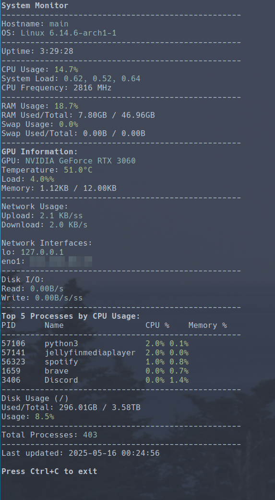

# System Monitor

A real-time system monitoring tool for Linux/Unix systems that provides a comprehensive view of your system's resources in the terminal.



## Features

- **CPU Monitoring**
  - CPU usage percentage
  - CPU frequency
  - CPU temperature
  - System load averages
  - Per-process CPU usage

- **Memory Monitoring**
  - RAM usage (percentage and used/total)
  - Swap usage
  - Per-process memory usage

- **GPU Monitoring** (if available)
  - GPU temperature
  - GPU load
  - GPU memory usage
  - Multiple GPU support

- **Disk Monitoring**
  - Disk usage for root partition
  - Real-time disk I/O rates
  - Read/Write speeds

- **Network Monitoring**
  - Upload/Download speeds
  - Network interface information
  - IP addresses

- **System Information**
  - Hostname and OS details
  - System uptime
  - Total process count
  - Battery status (for laptops)

## Requirements

- Python 3.6 or higher
- psutil
- GPUtil (optional, for GPU monitoring)

## Installation

1. Clone the repository:
```bash
git clone https://github.com/yourusername/systemMonitor.git
cd systemMonitor
```

2. Install the required packages:
```bash
pip install -r requirements.txt
```

## Usage

Run the script:
```bash
python systemMonitor.py
```

### Controls
- Press `Ctrl+C` to exit the monitor

### Color Coding
- Green: Normal usage (< 70%)
- Yellow: Warning (70-90%)
- Red: Critical (> 90%)

## Optional GPU Monitoring

To enable GPU monitoring, install GPUtil:
```bash
pip install GPUtil
```

## Contributing

Contributions are welcome! Please feel free to submit a Pull Request.

## License

This project is licensed under the GNU General Public License v3.0 - see the [LICENSE](LICENSE) file for details.

## Acknowledgments

- [psutil](https://github.com/giampaolo/psutil) for system monitoring capabilities
- [GPUtil](https://github.com/anderskm/gputil) for GPU monitoring (optional) 